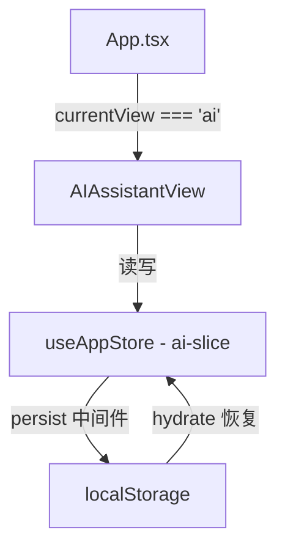

# AI 助手聊天历史持久化

**日期**: 2026-07-27  
**状态**: 待实现  

## 问题

`App.tsx` 使用条件渲染控制 AI 面板显隐：

```tsx
{currentView === 'ai' && <AIAssistantView />}
```

切换视图时组件卸载，内部 `useState<Message[]>` 消息历史销毁，用户返回 AI 助手时对话从头开始。

## 方案

将消息状态从组件 `useState` 提升到 Zustand store，叠加 `persist` 中间件实现跨会话保留。

### 架构



### 新增 `src/store/ai-slice.ts`

```ts
import { StateCreator } from 'zustand'

export interface Message {
  id: string
  role: 'user' | 'assistant'
  content: string
  timestamp: number
}

export interface AISlice {
  messages: Message[]
  isLoading: boolean
  addMessage: (msg: Omit<Message, 'id' | 'timestamp'>) => void
  updateLastAssistant: (content: string) => void
  setLoading: (loading: boolean) => void
  clearMessages: () => void
}

export const createAISlice: StateCreator<AISlice, [], [], AISlice> = (set) => ({
  messages: [],
  isLoading: false,

  addMessage: (msg) =>
    set((s) => ({
      messages: [
        ...s.messages.slice(-49),
        { ...msg, id: crypto.randomUUID(), timestamp: Date.now() },
      ],
    })),

  updateLastAssistant: (content) =>
    set((s) => {
      const msgs = [...s.messages]
      const last = msgs[msgs.length - 1]
      if (last?.role === 'assistant') {
        msgs[msgs.length - 1] = { ...last, content }
      }
      return { messages: msgs }
    }),

  setLoading: (loading) => set({ isLoading: loading }),
  clearMessages: () => set({ messages: [], isLoading: false }),
})
```

**设计决策**：
- `addMessage` 自动 FIFO 截断至最近 50 条，防止 localStorage 无限增长
- `updateLastAssistant` 专门用于流式响应逐字追加，避免流式场景下频繁创建新数组
- `crypto.randomUUID()` 零依赖生成唯一 ID
- `timestamp` 预留未来按时间清理的能力

### 修改 `src/store/index.ts`

在现有 `create` 调用外包裹 `persist` 中间件：

```ts
import { persist, createJSONStorage } from 'zustand/middleware'

export const useAppStore = create<CombinedSlice>()(
  persist(
    (...a) => ({
      ...createAISlice(...a),
      ...createUISlice(...a),
      ...createSettingsSlice(...a),
      // ...其他切片
    }),
    {
      name: 'taskflow-ai-storage',
      storage: createJSONStorage(() => localStorage),
      partialize: (state) => ({
        messages: (state as CombinedSlice).messages,
      }),
      version: 1,
    }
  )
)
```

**关键点**：
- `partialize` 仅持久化 `messages`，忽略 `isLoading`——刷新后不应显示加载中状态
- 版本化存储，未来字段变更时可平滑迁移

### 修改 `AIAssistantView.tsx`

- 删除 `useState<Message[]>` 和 `useState(false)`
- 从 store 解构：`messages`, `isLoading`, `addMessage`, `updateLastAssistant`, `setLoading`, `clearMessages`
- **欢迎消息**：不在 store 中存储，改为组件内条件渲染。当 `messages.length === 0` 时展示欢迎引导文案，有消息后隐藏
- 发送消息时用 `addMessage` 替代 `setMessages`
- 流式追加时用 `updateLastAssistant` 代替 `setMessages(prev => [...prev.slice(0,-1), ...])`
- 流式结束后用 `addMessage` 添加 AI 的后续消息（如任务拆解检测结果）
- 保持 UI 渲染逻辑不变

### 改动量

| 文件 | 操作 | 行数 |
|------|------|------|
| `src/store/ai-slice.ts` | 新增 | ~30 |
| `src/store/index.ts` | 修改 | +10 |
| `src/components/ai/AIAssistantView.tsx` | 修改 | ~15 |

总计约 55 行有效代码。

## 测试要点

- [ ] 切换视图（甘特图 → AI → 看板）后消息保留
- [ ] 刷新页面后消息恢复
- [ ] 发送第 51 条消息时，最早的消息被移除
- [ ] `isLoading` 不会被持久化（刷新后不显示加载态）
- [ ] 清空按钮正常清除消息和 localStorage
- [ ] 流式响应中切换视图再返回，已接收的部分消息保留
- [ ] 初始欢迎消息在首次加载时正常显示（无持久化数据时）